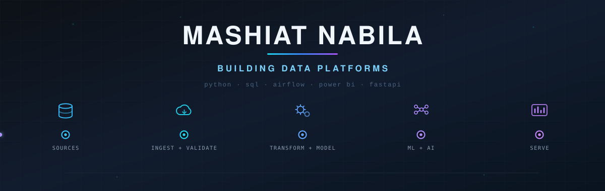

<p align="center">
  
</p>

<p align="center">
  <a href="https://www.linkedin.com/in/mashiat-nabila-0060a9115/">LinkedIn</a> ·
  <a href="mailto:nabila.mashiat@gmail.com">nabila.mashiat@gmail.com</a> ·
  Houston, TX (open to relocation)
</p>

---

## About

Six years building the data layer that other people's work depends on — ETL pipelines, schemas, and validation logic across high-volume production systems at **Ericsson** and **Banglalink**, where a broken pipeline meant a business decision made on the wrong number.

I care most about the unglamorous part: making sure the data is right before anyone builds on it. Automated quality checks, reconciliation across systems that disagree, and documentation that means a metric still means the same thing six months later.

Once the data is right, I build on it too: classification and risk models with explainability baked in (SHAP, not just a score), NLP and LLM-backed services, and Power BI / Tableau dashboards that turn curated tables into something a stakeholder can act on.

> **Previously:** LM Ericsson · Banglalink Digital Communications
> **Education:** M.S. Engineering Data Science, University of Houston
> **Now:** Building end-to-end data products — pipelines, ML tooling, and LLM-backed services — and open to Data Engineering, Data Science, and Analytics roles

---

## Projects

### ⚽ [WC2026 Command Center](https://github.com/nmashiat/wc2026-command-center)
End-to-end World Cup 2026 analytics platform — ingests match, team, and fan data into a modeled SQL layer, then serves business intelligence, ML match prediction with upset-risk scoring, and NLP fan-sentiment analysis from one dashboard.

`SQL` `Python` `Data Modeling` `scikit-learn` `NLP` `Dashboard`

### 🏗️ [GroundWork](https://github.com/nmashiat/GroundWork)
Schema-agnostic construction risk intelligence. Ingests arbitrary datasets, infers and validates structure, and serves Random Forest predictions with SHAP explainability through a FastAPI backend — so a stakeholder sees *why* a risk score moved, not just the number.

`Python` `FastAPI` `Schema Inference` `Random Forest` `SHAP` `React`

### 🎬 [YouTube Summarizer](https://github.com/nmashiat/youtube-summarizer)
LLM service that turns long-form video into structured JSON — key points, topics, sentiment. Prompt design, input validation, error handling, and an automated fallback path for edge cases.

`Python` `Claude API` `Whisper` `Prompt Engineering`

### 🧪 [CKD SQL Analytics](https://github.com/nmashiat/ckd-sql-analytics) · [CKD Prediction](https://github.com/nmashiat/ckd-prediction-ml)
Chronic kidney disease work in two parts — a SQL analytics layer for cohort segmentation and correlation analysis, and a feature-engineered classification pipeline comparing Naive Bayes, SVM, and Random Forest across precision, recall, F1, and ROC-AUC.

`SQLite` `SQL` `Python` `scikit-learn` `Feature Engineering`

<!--
TODO — add when ready:
### 🔁 [Pipeline project name](link)
Airflow-orchestrated ETL: source → staging → validated curated tables, with data-quality checks and alerting.
`Airflow` `PostgreSQL` `Python` `Data Quality`

### 📊 [Dashboard project name](link)
Power BI / Tableau dashboard built on a modeled data layer — include a screenshot in the repo README.
`Power BI` `DAX` `Data Modeling`
-->

---

## How I Build

```
Source systems → Ingest & validate → Transform & model → Curated tables → BI / ML
                        ↓                                        ↓
                  quality checks                          documentation
```

- **Validation belongs in the pipeline, not after it.** Automated checks catch integrity failures before anything downstream consumes them.
- **Model the data, then build on it.** Schemas and entity relationships first — reporting layers built on unmodeled data get rewritten.
- **Document as you go.** Metric definitions, source-to-target mappings, and specs, so the next person doesn't reverse-engineer intent from SQL.
- **Automate the recurring work.** Scheduled, validated pipelines instead of manual pulls.
- **Explain the model, not just the metric.** A prediction that can't be traced to its drivers doesn't get trusted or used.

---

## Stack

**Languages** — Python · SQL · JavaScript · Bash/Shell

**Data Engineering** — Apache Airflow · Talend · pandas · Oracle PL/SQL · PostgreSQL · MySQL · SQLite

**ML & NLP** — scikit-learn · SHAP · NLP · Claude API · Whisper

**BI & Analytics** — Power BI (Power Query, DAX) · Tableau

**Services & Tools** — FastAPI · Flask · React · REST APIs · Git

---

## Education

| Degree | Institution | Year |
| --- | --- | --- |
| M.S. Engineering Data Science | University of Houston | 2025 |
| M.S. Applied Statistics & Data Science | Jahangirnagar University | 2021 |
| B.S. Computer Science & Engineering | American International University-Bangladesh | 2017 |

**In progress:** AWS Certified Data Engineer – Associate · Microsoft PL-300 (Power BI Data Analyst)

---
